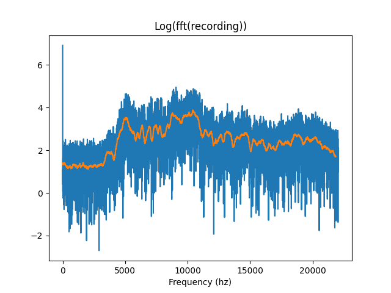
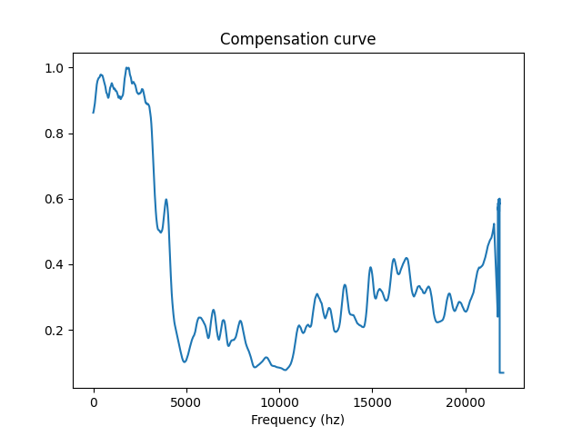
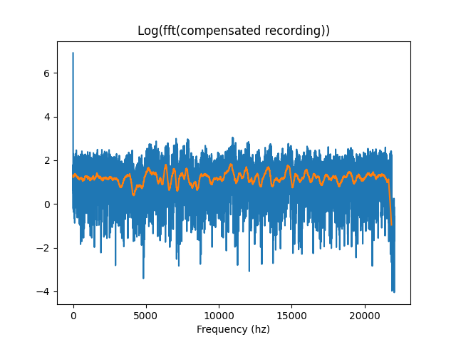
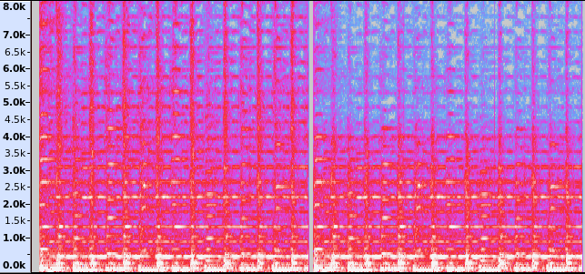
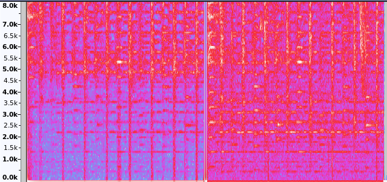

# Autospec
A simple tool for making bad microphones and headphones achieve higher fidelity

---
## How to use

(This assumes python 3.X and its pip command. For systems with python 2 and 3, use `pip3` and `python3`)

`pip install audiodevice scipy numpy matplotlib`

For generating a new filter curve (calibrating a new device), simply run the script with `python autospec.py`.

For processing a .wav file using that curve, run `python autospec.py <.wav file> <filter file>`. That'll play the original and processed audio on the default audio output.
## How it works

The script tries to estimate the microphone's sensitivity to frequencies (assuming a high-fidelity speaker) or the speaker's fidelity on reproducing those frequencies (assuming a high-fidelity microphone). For that, it emits white noise through the speaker and records it with the microphone.

The resulting recording is then analysed in the frequency domain using a Fourier Transform:

Ideally, this curve should be flat for white noise, so for that curve to happen, either our microphone isn't very sensitive to some frequencies or our speakers aren't emitting them correctly.

Correcting that is simple: the script generates a "compensation curve" which can be used to flatten that signal on the frequency domain by simply multiplying the two (correction = maximum(signal)/signal):

Having that curve, we now can filter signals so we're compensating for the frequencies we can't emit/capture by simply multiplying this curve to those signals in the frequency domain and applying the inverse Fourier Transform.

That curve can be applied to any other signal. For my experiments, I had a high-fidelity headset and a bad microphone biased towards high frequencies.

The compensation curve above was used to filter the initial 3 seconds of `rien.wav` (An excerpt from "La chanson des vers de Terre", by Opa Tsupa)

Here are the spectrograms of the signal sent to the speaker (on the left, the original signal, followed by the filtered one):

That results on the following signals received by the (high-frequency biased) microphone (on the left, what was perceived from the original signal, followed by the filtered one):

It's visibly fuller and more distinct in the lower frequencies, which can be confirmed subjectively by listening to "Filtered.mp3" (which depicts, in order, the original and filtered signals then their respective responses). The microphone fidelity is still low, but it sounds considerably better.

---

Made with <3 by Amélia O. on a Friday afternoon I should have spent doing something more important on.
